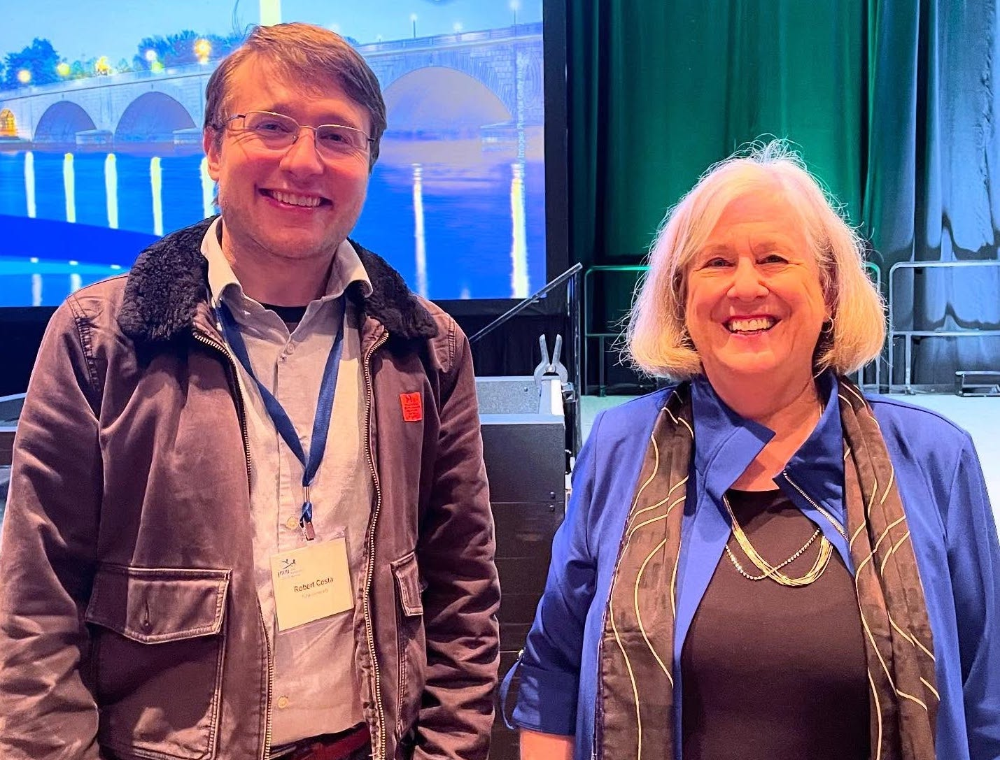
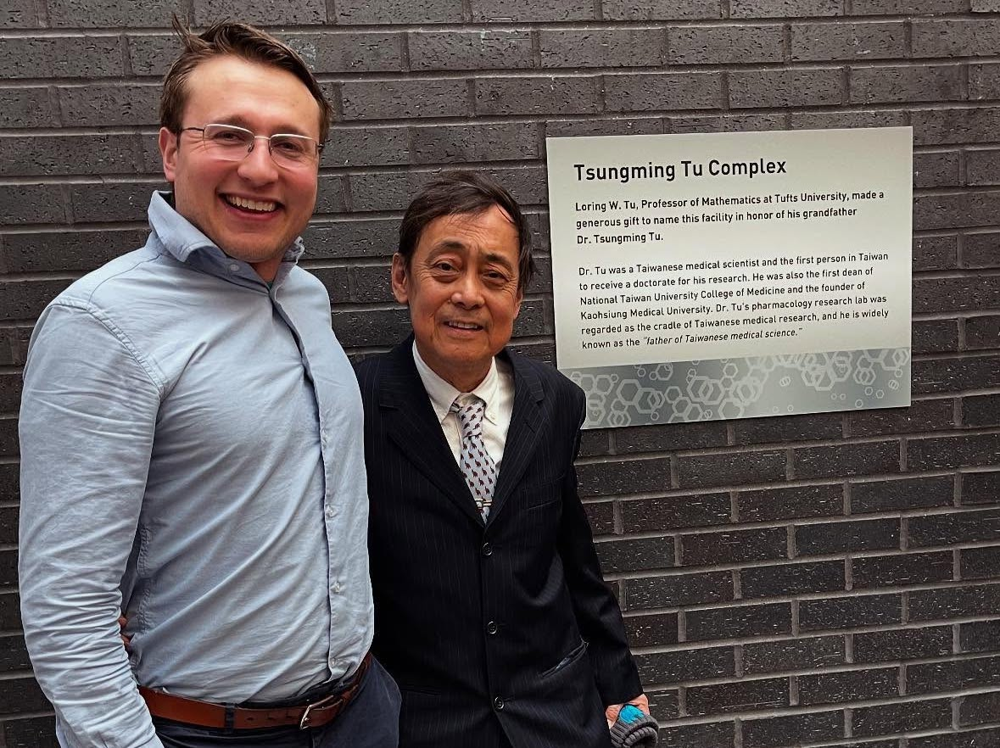
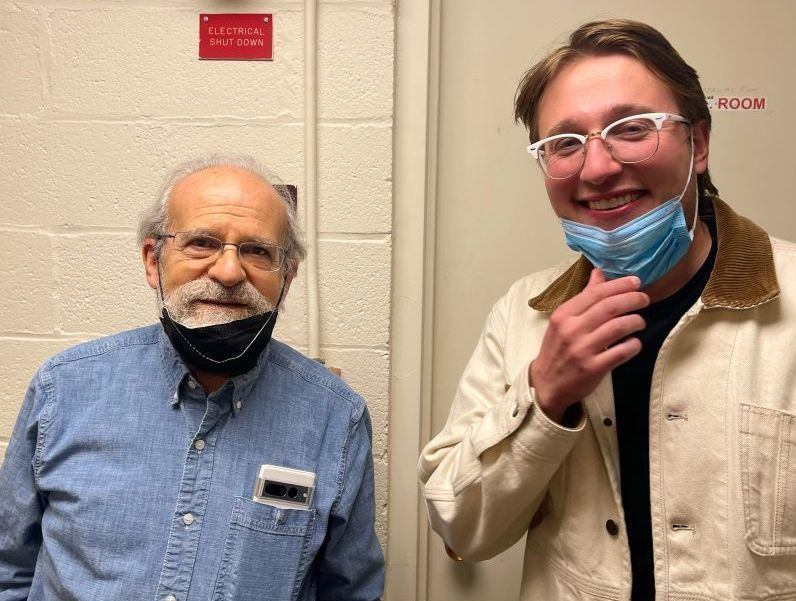
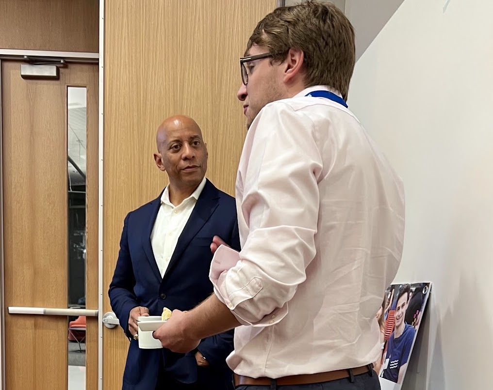
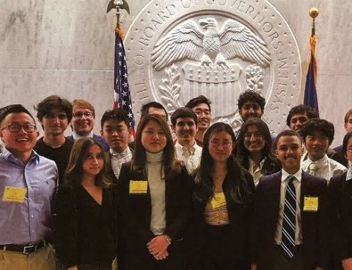
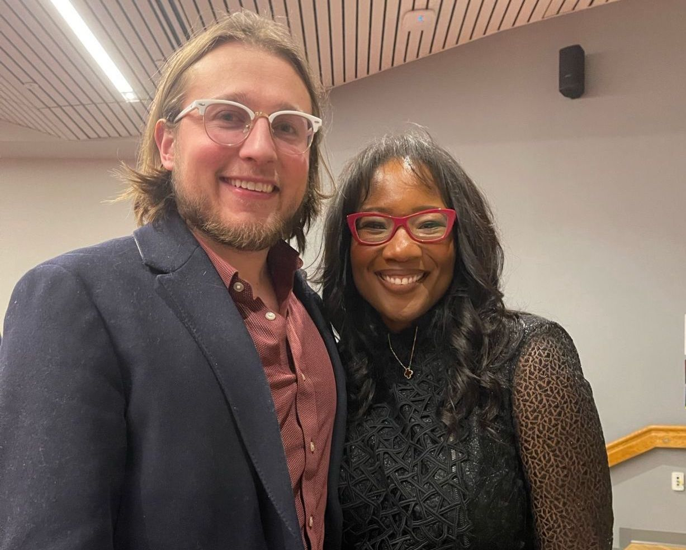

# About Me

### 📚 Navigation 📊
**[ [Home](README.md) | [About Me](about.md) ]**

Hi everyone, this is Rob.
I'm a senior systems developer at [InterSystems Corporation](https://www.intersystems.com/), where I have worked on InterSystems IntelliCare™ electronic health record and InterSystems IRIS® data platform that evolved out of [M(UMPS) database programming](https://en.wikipedia.org/wiki/MUMPS). I'm starting a PhD at [Tufts University](https://www.tufts.edu/) in low-latency execution, after completing a master's in computer science there.
This will be my third degree from Tufts overall, as I also completed my undergraduate degree in mathematics here.
I am working on an open-source quantitative trading system called [CandleSage](https://github.com/rcosta-git/CandleSage/tree/main), using [Hidden Markov Models](https://en.wikipedia.org/wiki/Hidden_Markov_model), [Long Short-Term Memory](https://en.wikipedia.org/wiki/Long_short-term_memory), [Prophet Models](https://facebook.github.io/prophet/), and [Transformers](https://en.wikipedia.org/wiki/Transformer_(deep_learning_architecture)).

I grew up in Northern Maine, and in 2009 I attended the [Research Science Institute](https://www.cee.org/programs/research-science-institute) (RSI) at MIT, where I used [modular forms](https://en.wikipedia.org/wiki/Modular_form) to study the [partition function](https://en.wikipedia.org/wiki/Partition_function_(number_theory)) in number theory. I graduated from the [Maine School of Science and Mathematics](https://www.mssm.org/), winning the 2010 [Siemens Award for Advanced Placement for the highest scores in Maine](https://www.bangordailynews.com/2011/02/27/news/magnet-school-seniors-state-winners-of-siemens-awards/), and interned at Maine's [Jackson Laboratory](https://www.jax.org/) in 2011, where I was first exposed to statistical computing, in bioinformatics.
As an undergraduate student at Tufts University, I was focused on pure math, studying abroad in Moscow in the summer of 2014, and in 2015 I published a paper in number theory on *p*-adic dynamical systems, [A *p*-adic Perron-Frobenius Theorem](https://arxiv.org/abs/1509.01702).
I also enjoyed set theory, type theory, category theory, and logic.
[See my logic-related Google Drive](https://drive.google.com/drive/folders/0B9bvsojRLzQ4fmVhUGdoby1URFRYYVZmMnh4dDFGLVc2YmdUVW5SdEdzZXl4OGF4ajcxajQ?resourcekey=0-XWGB5GzqOjIy6syC3Ah8qw&usp=sharing).

Below is a series of images with people who have inspired me. While I could write extensively about each of them, I'll highlight the last two in particular. I was invited, along with other [Research Science Institute](https://www.cee.org/research-science-institute) alumni, to meet [Jerome Powell](https://www.federalreserve.gov/aboutthefed/bios/board/powell.htm) at the [Federal Reserve](https://www.federalreserve.gov/). It was an honor for me to shake his hand and ask his thoughts on a quotation from [Milton Friedman](https://www.nobelprize.org/prizes/economic-sciences/1976/friedman/biographical/), whom he had been discussing with us. Our conversation deepened my interest in monetary policy, particularly the role of monetary aggregates in economic stability. Inspired by his insights, I began exploring financial markets more seriously, studying both historical perspectives and modern quantitative approaches. I also had the opportunity to take a photo with [Dr. Talithia D. Williams](https://www.talithiawilliams.com/), a statistician, educator, and the first African-American woman to achieve tenure at [Harvey Mudd College](https://www.hmc.edu/). Her emphasis on the power of data to uncover systemic disparities demonstrates how we can apply mathematics to real-world challenges. Beyond inspiring me to deepen my knowledge of statistics, she has helped encourage the way I think about leveraging quantitative methods for equity, education, and the public good.

  

    
    
<small>Rob with <a href="https://ai.meta.com/people/yann-lecun/">Yann LeCun</a>, the "father of deep learning", and VP, Meta Chief AI Scientist.</small>

  

  

    
    
<small>Rob with <a href="https://umaine.edu/president/">Joan Ferrini-Mundy</a>, President of the University of Maine and math educator.</small>

  

  

    
    
<small>Rob with <a href="https://en.wikipedia.org/wiki/Carlos_Alvarado_Quesada">Carlos Alvarado Quesada</a>, former president of Costa Rica, at Tufts University.</small>

  

  

    
    
<small>Rob with donor and philanthropist <a href="https://en.wikipedia.org/wiki/Bill_Cummings_(philanthropist)">Bill Cummings</a> speaking at Tufts University.</small>

  

  

    
    
<small>Rob with his mathematics advisor, professor and topologist <a href="https://en.wikipedia.org/wiki/Loring_W._Tu">Loring Tu</a> at Tufts University.</small>

  

  

    
    
<small>Rob with writer and drug addiction survivor "Beautiful Boy" <a href="https://en.wikipedia.org/wiki/Nic_Sheff">Nic Sheff</a> at Tufts University.</small>

  

  

    
    
<small>Rob with <a href="https://en.wikipedia.org/wiki/Pete_Wilson">Pete Wilson</a> and <a href="https://en.wikipedia.org/wiki/Gayle_Wilson">Gayle Wilson</a> at a Center for Excellence in Education reunion.</small>

  

  

    
    
<small>Rob with Tisch College administrators meeting <a href="https://en.wikipedia.org/wiki/Mick_Mulvaney">Mick Mulvaney</a> at Tufts University.</small>

  

  

    
    
<small>Rob with the VisiCalc spreadsheet co-creator <a href="https://en.wikipedia.org/wiki/Bob_Frankston">Bob Frankston</a> at Tufts University.</small>

  

  

    
    
<small>Rob speaking with DHS Under Secretary <a href="https://www.dhs.gov/archive/person/dr-reginald-brothers">Reggie Brothers</a> at Tufts University.</small>

  

  

    
    
<small>Rob and other students at the Federal Reserve after meeting chair <a href="https://en.wikipedia.org/wiki/Jerome_Powell">Jerome Powell</a>.</small>

  

  

    
    
<small>Rob with statistician and advocate <a href="https://en.wikipedia.org/wiki/Talithia_Williams">Talithia Williams</a> after her talk at Tufts University.</small>

  

© 2025 Robert Costa. All rights reserved.
